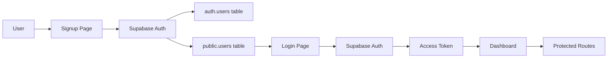

# 🎓 OJT Time Tracker - Complete Guide

## 🚨 Got Login Error? [START HERE →](/START_HERE.md)

---

## ✅ What I Fixed

| Issue | Status | Details |
|-------|--------|---------|
| RLS Policy Error | ✅ FIXED | Added `TO authenticated` to all policies |
| Server Auth Routes | ✅ REMOVED | Auth now 100% client-side |
| Session Management | ✅ IMPROVED | Better token storage |
| Login Credentials Error | ⚠️ SETUP NEEDED | See below |

---

## 🚀 Quick Setup (3 Minutes)

### Step 1: Configure Supabase

**Open Supabase Dashboard:**

1. **Run SQL Schema**
   - SQL Editor → New Query
   - Copy `/database-schema.sql` → Run

2. **Disable Email Confirmation**
   - Authentication → Settings → Email
   - Toggle OFF "Confirm email" → Save

### Step 2: Create Account

1. Go to `/signup` in your app
2. Fill in:
   - Email: test@example.com
   - Password: password123
   - Full Name: Test User
3. Click "Create Account"

### Step 3: Sign In

1. Go to `/login`
2. Enter same credentials
3. Click "Sign In"
4. You're in! 🎉

---

## 📁 Project Structure

```
/
├── src/app/
│   ├── App.tsx                    # Main app component
│   ├── routes.tsx                 # React Router config
│   ├── auth-utils.ts              # Auth helper functions
│   ├── supabase-client.ts         # Supabase client
│   └── components/
│       ├── LoginPage.tsx          # Login page
│       ├── SignupPage.tsx         # Signup page
│       ├── SetupForm.tsx          # OJT setup form
│       ├── Dashboard.tsx          # Main dashboard
│       ├── TimeLogForm.tsx        # Time logging form
│       └── ui/                    # UI components
│
├── supabase/functions/server/
│   ├── index.tsx                  # API routes
│   └── kv_store.tsx              # Key-value utilities
│
├── database-schema.sql            # Complete DB schema
├── FIX_RLS_POLICIES.sql          # RLS policy fixes
│
└── Documentation/
    ├── START_HERE.md              # Fix login errors ⭐
    ├── SUMMARY.md                 # Overview of fixes
    ├── TESTING_GUIDE.md           # Testing instructions
    ├── DIAGNOSIS.md               # Error diagnosis
    ├── EMAIL_CONFIRMATION_FIX.md  # Email setup
    ├── FIX_RLS_ERROR.md          # RLS troubleshooting
    └── QUICK_FIX.md              # Quick fixes
```

---

## 🔐 Authentication Flow



**Key Points:**
- ✅ 100% client-side authentication
- ✅ No server auth endpoints
- ✅ Supabase handles everything
- ✅ RLS protects all data

---

## 🗄️ Database Schema

### Tables

1. **`auth.users`** - Supabase auth users (managed by Supabase)
2. **`public.users`** - User profiles
3. **`public.ojt_setup`** - OJT configuration
4. **`public.time_logs`** - Daily time entries
5. **`public.calendar_events`** - Calendar events

### Row Level Security (RLS)

All tables have RLS enabled with these policies:
- Users can **only** access their own data
- `auth.uid()` must match `user_id`
- All policies use `TO authenticated`

---

## 🎯 Features

| Feature | Status | Description |
|---------|--------|-------------|
| Signup/Login | ✅ | Client-side auth |
| OJT Setup | ✅ | Configure hours & schedule |
| Time Tracking | ✅ | Log daily hours |
| Statistics | ✅ | Total, remaining, progress |
| Progress Bar | ✅ | Visual completion % |
| Calendar | ✅ | Mark important events |
| Accomplishments | ✅ | Daily notes |
| Photo Attachments | ✅ | Upload photos |
| Offline Mode | ✅ | Work without internet |
| Data Persistence | ✅ | Auto-save to database |

---

## 🐛 Common Errors & Fixes

### 1. "Invalid login credentials"

**Cause:** User doesn't exist or email not confirmed

**Fix:** 
```bash
1. Go to /signup and create account
2. OR disable email confirmation in Supabase
3. OR run: UPDATE auth.users SET email_confirmed_at = NOW();
```

### 2. "new row violates row-level security policy"

**Cause:** RLS policies missing `TO authenticated`

**Fix:**
```sql
-- Run /FIX_RLS_POLICIES.sql
```

### 3. "Unauthorized"

**Cause:** Not logged in or token expired

**Fix:**
```bash
1. Log out
2. Clear browser localStorage
3. Log in again
```

### 4. "Failed to fetch user profile"

**Cause:** User in auth.users but not in public.users

**Fix:**
```sql
INSERT INTO public.users (id, email, full_name)
SELECT id, email, raw_user_meta_data->>'full_name'
FROM auth.users
WHERE id NOT IN (SELECT id FROM public.users);
```

---

## 🧪 Testing Checklist

- [ ] Run database schema
- [ ] Disable email confirmation
- [ ] Clear browser storage
- [ ] Create account
- [ ] Sign in
- [ ] Complete OJT setup
- [ ] Add time log
- [ ] Check statistics
- [ ] Add calendar event
- [ ] Log out and log in
- [ ] Verify data persists

---

## 📊 Tech Stack

| Category | Technology |
|----------|------------|
| Frontend | React + TypeScript |
| Routing | React Router v7 |
| Styling | Tailwind CSS v4 |
| UI Components | shadcn/ui |
| Icons | Lucide React |
| Backend | Supabase Edge Functions |
| Database | PostgreSQL (Supabase) |
| Auth | Supabase Auth |
| Storage | Supabase Storage |

---

## 🔧 API Routes (Server)

All routes require `Authorization: Bearer <access_token>` header:

| Method | Endpoint | Description |
|--------|----------|-------------|
| GET | `/health` | Health check |
| GET | `/info` | API info |
| GET | `/setup` | Get user setup |
| POST | `/setup` | Create/update setup |
| DELETE | `/setup` | Delete setup |
| GET | `/logs` | Get time logs |
| POST | `/logs` | Create log |
| DELETE | `/logs/:id` | Delete log |
| GET | `/events` | Get calendar events |
| POST | `/events` | Create event |
| PUT | `/events/:id` | Update event |
| DELETE | `/events/:id` | Delete event |
| GET | `/stats` | Get statistics |

---

## 🎓 For Students

This app helps you:
- ✅ Track internship hours accurately
- ✅ Monitor progress toward completion
- ✅ Estimate your end date
- ✅ Keep accomplishment records
- ✅ Manage important events
- ✅ Stay organized

---

## 📝 License

This project is for educational purposes.

---

## 🆘 Need Help?

1. **Login issues?** → Read `/START_HERE.md`
2. **Setup questions?** → Read `/TESTING_GUIDE.md`
3. **Database errors?** → Read `/FIX_RLS_ERROR.md`
4. **General help?** → Read `/SUMMARY.md`

---

## 🎉 You're All Set!

Your OJT Time Tracker is ready to use! Just:

1. **[Read START_HERE.md](/START_HERE.md)** ← Fix any errors
2. **Create an account** at `/signup`
3. **Start tracking** your hours!

Happy tracking! 🚀
